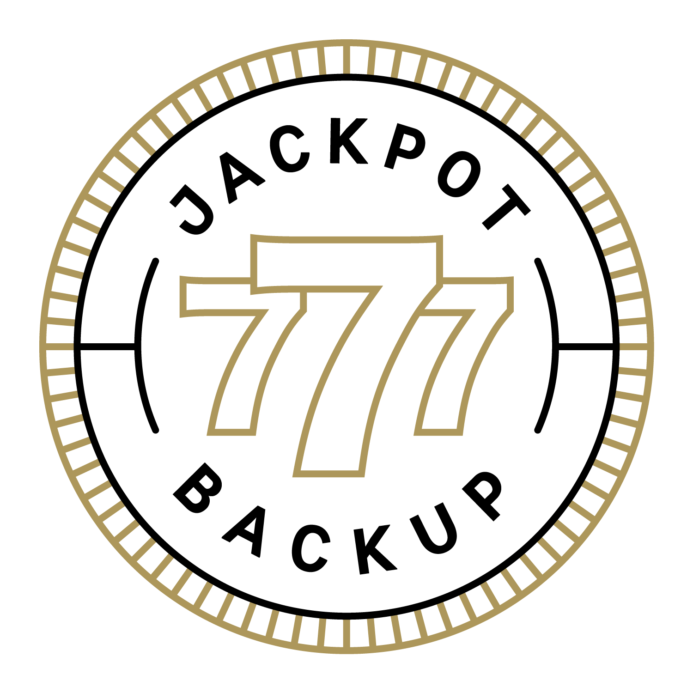

# Jackpot Backup



Jackpot backups all of your files from the last:
  * 7 days
  * 7 months (one backup each month)
  * 7 years (one backup each year)

777? You hit the Jackpot!

## About Jackpot

Jackpot stores your files:
  * Locally - in the **/backups** directory
  * Remotely in S3 and/or Google Cloud (optional)

Each backup is compressed into a single `.tar.gz` file - with the name of the file
representing the timestamp of when the backup was created:

```
Example:
04-20-2017_22-47-51.tar.gz
```

Jackpot automatically removes daily backups older than 7 days, monthly backups
older than 7 months, and yearly backups older than 7 years.

## Getting Started

```
git clone https://github.com/clevyr/jackpot-backup.git
cd jackpot-backup
cp conf.sh.example conf.sh

# Now edit conf.sh
```

Here's what you need to edit in `conf.sh`:

```
REQUIRED:
  main_backup()

OPTIONAL:
  after_backup()

  To Add AWS S3 Syncing, edit:
    S3_BUCKET - the name of the AWS S3 bucket with which you are syncing
    AWS_PATH  - the full path to the aws command

  To Add Google Cloud Syncing, edit:
    GOOGLE_CLOUD_BUCKET - the name of the Google Cloud Storage bucket with which you are syncing
    GSUTIL_PATH         - the full path to the gsutil command
```

### main_backup
The `main_backup` function is where you will issue shell commands to create
all of your backup scripts. This function gets passed the directory (`$1`) where
you should dump all of your files:

```
# Example
main_backup () {
  mysqldump -u foo -p bar db > $1/backup.sql
}
```

Anything in the `$1` directory will get compressed into a single `.tar.gz` file, and that
becomes your backup. Store database dumps, code, assets, anything you want
in there!

### after_backup (optional)
The `after_backup` function is where you can perform any extra logic once your
backup has been created - such as manually copying your new backup over to a
mounted drive, or storing it in another location on the server.
This function gets passed the compressed backup file (`$1`).

```
# Example
after_backup () {
  scp $1 new.server.com:~/backups
}
```

## Running Jackpot
```
./jackpot.sh
```

### In Production

In production, you'll normally want to set up jackpot as a cron job that runs
regularly:

```
# Every day at midnight
0 0 * * * full/path/to/jackpot.sh
```

## Prerequisites

This library depends on the **GNU Date** command. This exists on linux
distributions by default. On Mac OSX, it doesn't - so you'll need to install the
coreutils package to get it:

```
brew install coreutils

# Now you can run `gdate`
```

### For AWS S3 Backup

To sync to an AWS S3 bucket, you must have the `aws` cli tool installed and
configured with credentials to access the bucket. [More
info here](https://aws.amazon.com/cli/).

### For Google Cloud Backup

To sync to a Google Cloud bucket, you must have the Google Cloud SDK cli
tools installed and configured with credentials to access the bucket.
[More info here](https://cloud.google.com/sdk/docs/).


MIT Licensed

[Clevyr, Inc.](https://clevyr.com)
